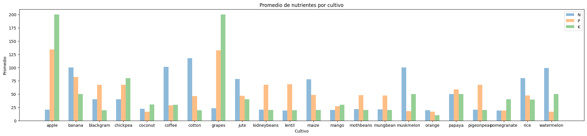
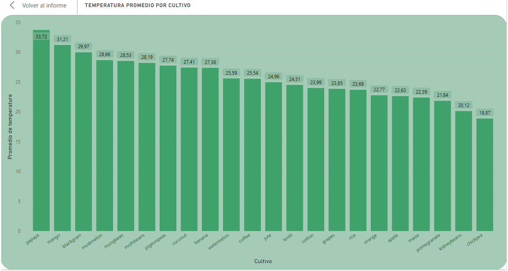
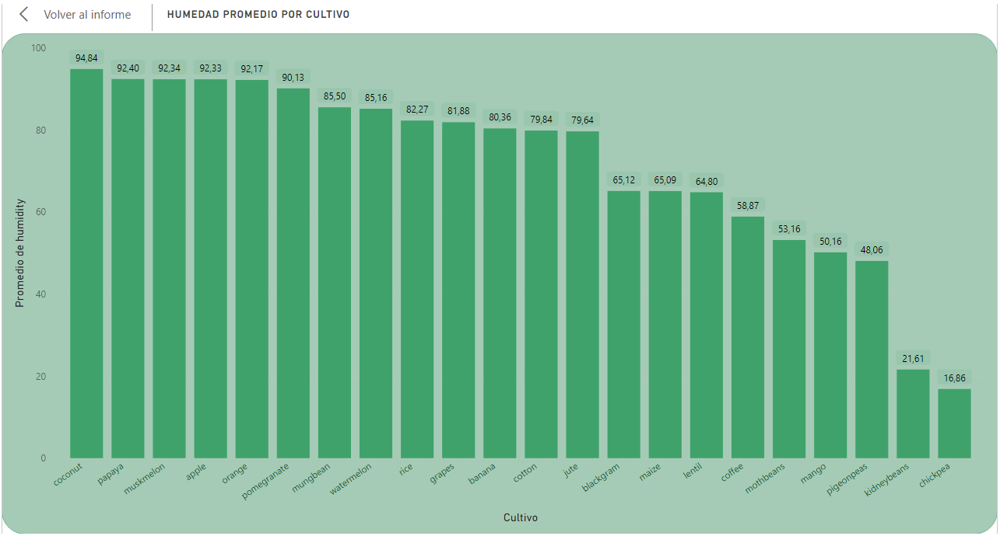
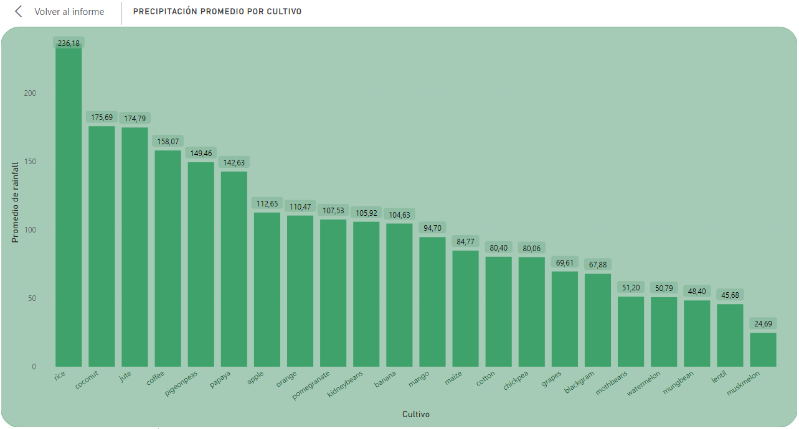
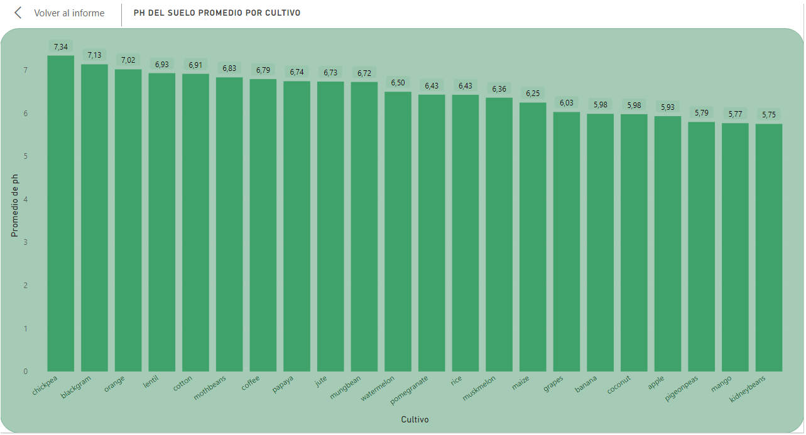

# <h1 align=center> **Cosulta de Requerimiento de Cultivos**
# <h1 align=center> **Daniel Suárez**
### <h1 align=center> **`Análisis de Datos y Machine Learning`**

El siguiente proyecto consiste en la realización de un análisis completo de datos climatológicos y de suelos y las condiciones en que se desarrollan diferentes cultivos. Entre otras cosas, se desarrolló un dashboard (PBI Cultivos.pbix o PBI Cultivos.pdf) para visualizar de manera amena el comportamiento de las demandas de cada cultivo en sus diferentes condiciones, ya sea por parte de requerimientos de nutrientes como el nitrógeno, el fósforo y el potasio, así como los requerimientos en cuanto al clima y parte de la química del suelo donde se desarrollan los diferentes cultivos. De esa misma forma, se desarrolló una aplicación de consulta en la plataforma de Streamlit (https://requerimientodecultivos.streamlit.app/) donde, de igual manera, se pueden visualizar los datos de requerimientos por cada determinado cultivo. Además, cuenta con un modelo de Machine Learning donde, ingresando los datos de disponibilidad de nutrientes y condiciones climáticas y de suelo específicas, el modelo es capaz de predecir qué cultivo se adaptaría mejor y pudiera desarrollarse en dichas condiciones. Asimismo, dependiendo del cultivo que dé como resultado, el mismo sistema puede sugerir algunos otros cultivos que pudieran desarrollarse en las condiciones propuestas.

Enlace de GitHub: https://github.com/DSuarezPaez/Proyecto_Cosulta_de_Requerimiento_de_Cultivos

a continuacion, se describen los trabajos realizados para el desarrollo de este proyecto.

## <h1 align=center> **`Análisis Exploratorio De Datos`**

Documento: EDA_y_ML.ipynb

El código desarrollado realiza varias operaciones en un DataFrame de pandas llamado 'data', la cual contiene información sobre diferentes condiciones agrologicas y sus cultivos. Y se llevó a cabo de la siguiente manera:

**1.- Detección de Outliers**

Se calculan los cuartiles y el rango intercuartílico (IQR) de todas las columnas para identificar los outliers. Los outliers son valores que son significativamente diferentes de los demás en un conjunto de datos. En este caso, se utilizan los cuartiles y el IQR para definir los límites superior e inferior para los Outliers.

De acuerdo a lo observado en la descripción estadística y los gráficos generados de las variables numéricas se pudo notar la presencia de outliers en las siguientes variable: ‘rainfall’, los valores considerados fuera de parámetros fueron tratados de igual manera que los demás datos ya que son datos climaticos y no se consideran errados.

**2.- Detección de valores duplicados**

Para el DataFrame utilizado no se detectaron valores duplicados.

**3.- Detección de valores faltantes**

Para el DataFrame utilizado no se detectaron valores duplicados.

**4.- Distribución de las variables**

Consistió en la creación de varios histogramas de las variables numéricas, donde se evidencia un comportamiento típico en la mayoría de las variables. Por otra parte, la presencia de valores atípicos o ‘outliers’ puede indicar datos erróneos, sin embargo, se consideran correctos ya que son datos climatológicos y de suelos en los cuales suelen presentar mucha variación. En el caso de Potasio (‘K’) y Precipitación (‘rainfall’), fueron las variables que presentaron valores atípicos. Puedes encontrar más información sobre la detección de outliers en el archivo (EDA_y_ML.ipynb - Distribución de Variables y EDA_y_ML.ipynb - Deteccion de Outliers).

**5.- Relación entre las variables**

Se creó una matriz de dispersión (scatter matrix) para las variables numéricas del DataFrame. Una matriz de dispersión es una matriz de gráficos de dispersión, donde cada celda de la matriz es un gráfico de dispersión que muestra la relación entre dos variables. En ese mismo sentido también se creó un mapa de calor de estas correlaciones para representar gráficamente a través de un degradado de colores para indicar la magnitud de los valores la misma. (EDA_y_ML.ipynb - Relacion de Variables).

**6.- Identificación de Patrones y Tendencias**

Para esta parte del análisis, se utilizaron librerías de visualización de datos para identificar patrones y/o tendencias en el comportamiento de las curvas generadas en los gráficos.

**Análisis De Gráficos, Métricas E Indicadores De Rendimiento**

**Contexto General**

### <h1 align=center> **Requerimientos de Nitrógeno, Fósforo y Potasio**

En 117,77, el cultivo de Algodón (cotton) tenía el mayor valor promedio de N y era 527,44% superior al cultivo de Lenteja (lentil), que tenía el promedio de N más bajo en 18,77. Por otra parte, en 200,11, el cultivo de Uva (grapes) tenía el valor más alto en promedio de K y era 1.899,10% superior al cultivo de Naranja (orange), que tenía el promedio de K más bajo en 10,01. También se puede observar que, en 134,22, el cultivo de Manzana (apple) tenía el mayor valor promedio de P y era 711,00% superior al cultivo de Naranja (orange), que tenía el promedio de P más bajo en 16,55. Además, se puede observar que el promedio de P y el promedio total de K se correlacionan positivamente entre sí.

en ese mismo sentido, cabe destacar el promedio general para cada uno de los nutrientes necesarios para el desarrollo de los cultivos.

### <h1 align=center> **Temperatura**

En 33,72, el cultivo de Lechoza (papaya) tenía el valor más alto Promedio de Temperatura y era 78,69% superior al cultivo de Garbanzo (chickpea), que tenía el Promedio de Temperatura más bajo en 18,87.

### <h1 align=center> **Humedad**

En 94,84, el cultivo de Coco (coconut) tenía el valor más alto Promedio de Humedad y era 462,53% superior al cultivo de Garbanzo (chickpea), que tenía el Promedio de Humedad más bajo en 16,86.

### <h1 align=center> **Precipitación**

En 236,18, el cultivo de Arroz (rice) tenía el valor más alto de Promedio de Precipitación (rainfall) y era 856,59% superior a Melón (muskmelon), que tenía el Promedio de Precipitación (rainfall) más bajo en 24,69.

### <h1 align=center> **pH**

En 7,34, el cultivo de Garbanzo (chickpea) tenía el valor más alto Promedio de pH del suelo y era 27,61% superior al cultivo de Frijoles (kidneybeans), que tenía el Promedio de pH del suelo más bajo en 5,75.

Contacto:

linkedin - https://www.linkedin.com/in/daniel-suarez-paez/
email - suarezdanieljo@gmail.com

El estatus correspondiente al proyecto es de: completo/publicado.
# Cosulta de Requerimiento de Cultivos